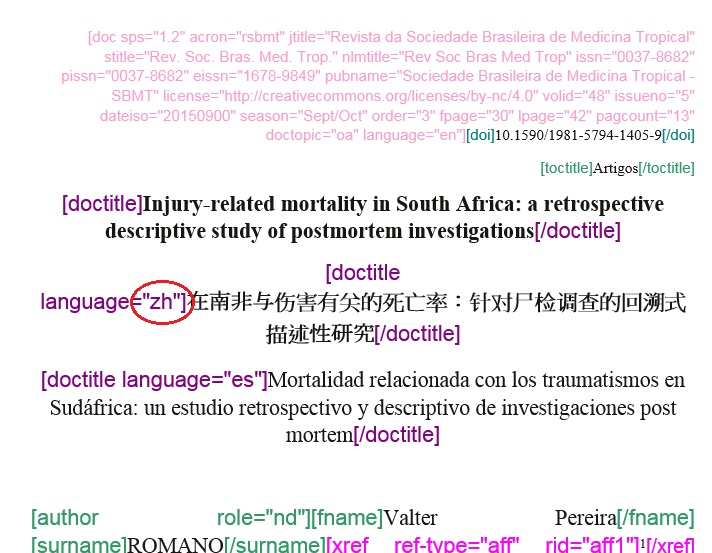
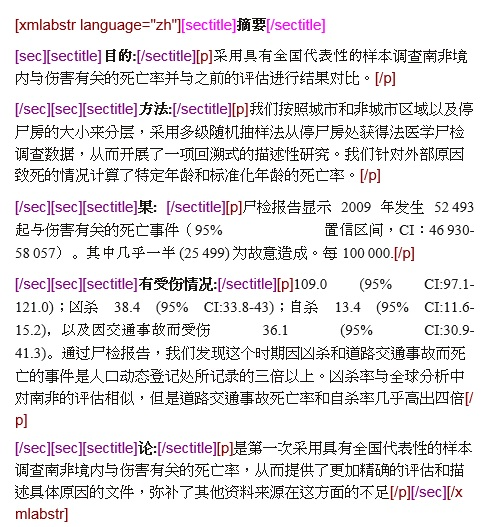
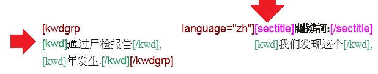
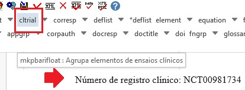

.. _doc-mkp:

Documentação de uso Markup
==========================

Manual de marcação de arquivos para geração de XML de acordo com SciELO Publishing Schema (SciELO PS). 

.. _introduction:

Introdução
==========

Este manual tem como objetivo auxiliar no processo de marcação de arquivos para geração de XML de acordo com SciELO PS.
Para padrões de nomeação de arquivos consultar  Regra de Nomeação de Arquivos em :ref:`regra-nomeação`

.. _requirements-markup:

 Requisitos para iniciar a Marcação
 ===================================
 
 Antes de iniciar o processo de marcação, é necessário seguir alguns passos para preparação do arquivo que será marcado.
 Veja abaixo os requisitos para a marcação do documento.
 
 * Os arquivos devem estar em formato Word (.doc) ou (.docx).
 * A estrutura de pastas deve seguir o padrão SciELO
 * Os arquivos devem ser formatados de acordo com a Formatação SciELO.
 

.. note:: A nomeação dos arquivos que serão trabalhados não deve conter espaços, acentos ou
         caracteres especiais. Caso seja necessário separar uma informação de outra use underline. 
         Apenas dessa forma as imagens marcadas no corpo do texto serão renomeadas e geradas corretamente. 
         Exemplo: ACB_2345.doc

.. _structure-folders:

Estrutura de pastas
===================

Antes de iniciar a marcação, é necessário garantir que a estrutura de pastas
esteja como segue:

  .. image:: img/doc-mkp-estrutura.jpg

Veja que dentro da pasta "markup_xml" foi inserido 2 pastas, no mesmo nível:

 * src: A pasta src (source) é utilizada para inserir os arquivos .pdf, vídeos e suplementos.
 * scielo_markup: Nessa pasta deve ser inserido os arquivos .doc ou .docx.

..  note:: Caso o responsável pela marcação não siga a recomendação de estrutura apresentada acima, não será 
           possível iniciar a marcação do documento e gerar o arquivo .xml.

.. _format-scielo:

Formatação SciELO
------------------

Para otimizar o processo de marcação dos elementos básicos do arquivo, é necessário seguir o padrão de formatação SciELO disponível abaixo:

**Instruções para formatação de dados básicos do artigo:**

 * Primeira linha do documento, inserir número de DOI (somente se presente), caso não exista deixar linha em branco;
 * Na próxima linha, inserir a seção do sumário (Se ausente, deixar linha em branco);
 * Linha 3: Título do artigo;
 * Linhas seguintes: Títulos traduzidos do arquivo;
 * Para separar autores de título, pular 1 linha;
 * Cada autor deve estar em uma linha e usar "sup" para label;
 * Pular 1 linha para separar autores de afiliações;
 * Cada afiliação deve estar em uma linha;
 * Pular 1 linha para separar afiliação de resumos;
 * Resumos estruturados: negrito no nome da seção;
 * Palavras-chave: os separadores devem ser ou ponto-e-vírgula ou vírgula;
 * Seções: negrito, Times New Roman, 16, centralizadas;
 * Subseções: negrito, Times New Roman, 14, centralizadas;
 * Subseção de subseção: negrito Times New Roman, 13, centralizadas;
 * Texto: formatação livre;
 * Para tabelas, label e caption na linha antes da imagem, mas os demais, após a imagem;
 * Separador de label e caption: dois-pontos e espaço ou espaço + hífen + espaço ou ponto + espaço;
 * Para tabelas codificadas, o cabeçalho deve estar em negrito;
 * A citação de autor/data no corpo do texto deve ser: sobrenome do autor, ano;
 * Para citação no sistema numérico no corpo do texto: "sup" e entre parênteses;
 * Notas de rodapé no corpo do texto podem estar em "sup", mas não estarão entre parênteses;
 * Citações (quote), recuo de 4 cm da margem esquerda;

Exemplo:

   .. image:: img/doc-mkp-2mostra.jpg

.. note:: As imagens dos arquivos devem estar disponíveis no arquivo .doc e marcado com o elemento indicado.

.. _attribution-id:

Sugestão de Atribuição de “ID”
-----------------------------

Para composição do “ID” combine o prefixo do tipo do elemento e um número inteiro, como segue::

+------------------------+---------------------------+---------+--------------------+
|Elemento XML            | Descrição                 | Prefixo | Exemplo            |
+========================+===========================+=========+====================+
| aff                    | Afiliação                 | aff     | aff1, aff2...      |
+------------------------+---------------------------+---------+--------------------+
| app                    | Apêndice                  | app     | app1, app2...      |
+------------------------+---------------------------+---------+--------------------+
| author-notes/fn        | Notas de rodape do        | fn      | fn1, fn2 ...       |
| fn-group/fn            | artigo                    |         |                    |
+------------------------+---------------------------+---------+--------------------+
| corresp                | Correspondência           | c       | c1, c2 ...         |
+------------------------+---------------------------+---------+--------------------+
| def-list               | lista de definição        | d       | d1, d2 ...         |
+------------------------+---------------------------+---------+--------------------+
| disp-formula           | Equação                   | e       | e1, e2 ...         |
+------------------------+---------------------------+---------+--------------------+
| fig                    | Figuras                   | f       | f1, f2 ...         |
+------------------------+---------------------------+---------+--------------------+
| media                  | Media                     | m       | m1, m2 ...         |
+------------------------+---------------------------+---------+--------------------+
| ref                    | Referência Bibliográfica  | B       | B1, B2 ...         |
+------------------------+---------------------------+---------+--------------------+
| sec                    | Seções                    | sec     | sec1, sec2 ...     |
+------------------------+---------------------------+---------+--------------------+
| supplementary-material | Suplemento                | suppl   | suppl1, suppl2 ... |
+------------------------+---------------------------+---------+--------------------+
|table-wrap-foot/fn      | Notas de rodapé de tabela | TFN     | TFN1, TFN2 ...     |
+------------------------+---------------------------+---------+--------------------+
| table-wrap             | Tabela                    | t       | t1, t2 ...         |
+------------------------+---------------------------+---------+--------------------+

.. _markup-elements:

Marcação dos elementos básicos do documento
===========================================

Após formatar os dados básicos do arquivo, o próximo passo é dar início a marcação XML. 
Primeiramente, abra o arquivo .doc no Word e selecione a tag [doc]:

.. image:: doc-mkp-formulario.jpg

Perceba que ao clicar em [doc] o programa irá abrir uma caixa de diálogo onde deverá ser inserido os metadados do arquivo:

Insira o nome da revista no campo jtitle* que o programa irá inserir as informações da revista automaticamente. 
Feito isso, o próximo passo é completar as informações nos demais campos. Veja abaixo os campos que devem ser preenchidos:

+-------------------+---------------------------------------------------------------------------------------+
| Campo             | Descrição                                                                             |
+===================+=======================================================================================+
| license           | se não for inserido automaticamente, preencher com a URL da licença creative commons  |
|                   | adotada pelo periódico                                                                |
+-------------------+---------------------------------------------------------------------------------------+
| volid             | Inserir volume, se existir                                                            |
+-------------------+---------------------------------------------------------------------------------------+
| supplvol          | Caso seja um suplemento de volume incluir sua parte ou número correspondente.         |
|                   | **Exemplo: vol.12 supl.A**, então preencha com **A**, neste campo                     |
+-------------------+---------------------------------------------------------------------------------------+
| issueno           | Entre com o número do fascículo. Caso seja um artigo publicado em ahead of            |
|                   | print, insira ahead neste campo                                                       |
+-------------------+---------------------------------------------------------------------------------------+
| supplno           | Caso seja um suplemento de fascículo incluir sua parte ou número                      |
|                   | correspondente. **Exemplo: n.37, supl.A**, então preencha com **A** neste campo       |
+-------------------+---------------------------------------------------------------------------------------+
| isidpart          | Usar em casos de press release, incluindo a sigla pr                                  |
+-------------------+---------------------------------------------------------------------------------------+
| dateiso           | Data de publicação formada por ano, mês e dia **(YYYYMMDD)**. Preencher sempre        |
|                   | com o último mês da periodicidade. Por exemplo, se o periódico é bimestral            |
|                   | preencher **20140600**. Use **00** para mês e dia nos casos em não haja sua           |
|                   | identificação. **Exemplo: 20140000**.                                                 |
+-------------------+---------------------------------------------------------------------------------------+
| month/season      | Entre o mês ou mês inicial barra final, em inglês (três letras) e ponto,              |
|                   | exceto para May, June e July. **Ex.: May/June, July/Aug.**                            |
+-------------------+---------------------------------------------------------------------------------------+
| fpage             | Primeira página do documento                                                          |
+-------------------+---------------------------------------------------------------------------------------+
| @seq              | Para artigos que iniciam na mesma página de um artigo anterior, incluir a             |
|                   | sequência com letra                                                                   |
+-------------------+---------------------------------------------------------------------------------------+
| lpage             | Inserir a última página do documento                                                  |
+-------------------+---------------------------------------------------------------------------------------+
| elocatid          | Elocatid                                                                              |
+-------------------+---------------------------------------------------------------------------------------+
| order (in TOC)    | Incluir a ordem do artigo no sumário do fascículo. Deve ter, no mínimo, dois          |
|                   | dígitos. Por exemplo, se o artigo for o primeiro do sumário, preencha este            |
|                   | campo com **01** e assim por diante.                                                  |
+-------------------+---------------------------------------------------------------------------------------+
| pagcount*         | Inserir o total de paginação                                                          |
+-------------------+---------------------------------------------------------------------------------------+
| doctopic*         | Informar o tipo de documento a ser marcado. Por exemplo: artigo original, resenha,    | 
|                   | carta, comentário, etc                                                                |
+-------------------+---------------------------------------------------------------------------------------+
| language*         | Informe o idioma principal do texto a ser marcado                                     |
+-------------------+---------------------------------------------------------------------------------------+
| version*          | Identifica a versão da DTD usada no processo de marcação (A versão atual é 4.0)       |
+-------------------+---------------------------------------------------------------------------------------+
| artdate (rolling) | Obrigatório completar com a data **YYYYMMDD** quando for um artigo rolling pass.      |
|                   | Rolling pass é um modelo publicação onde o periódico publica seus artigos num volume  |
|                   | único a medida em que estes ficam prontos                                             |
+-------------------+---------------------------------------------------------------------------------------+
| ahpdate           | Indicar a data de publicação de um artigo publicado em ahead of print                 |
+-------------------+---------------------------------------------------------------------------------------+

.. note:: Os campos que apresentam um asterisco ao lado, são campos obrigatórios.

.. _markup-front:

Marcação automática do 'front'
==============================

Tendo preenchido todos os campos, ao clicar em [Ok] o programa irá abrir uma janela perguntando se o documento está de acordo com o modelo para efetuar a marcação automática:

Ao clicar em [Sim] veja que o programa efetua a marcação automática dos elementos básicos do documento:

.. note:: Caso o arquivo esteja com a formatação recomendada, o programa Markup irá fazer a marcação automática de DOI, seção 
          (esses dois primeiros, se presente), título e títulos traduzidos, autores, label de autores e afiliações.

Após a marcação automática é necessário completar a marcação dos elementos básicos. 

.. _title:

Doctitle
--------

Confira o idioma inserido em [doctitle] para títulos traduzidos e se necessário, corrija.
Para corrigir, selecione a tag "incorreta" e clique no botão "lápis" para editar os atributos:

 Faça o mesmo para os demais títulos traduzidos.

.. _authors:

Autores
-------

Alguns autores apresentam mais que 1 label ao lado do nome, porém o programa não faz a marcação automática de mais que 1 label. Para isso, selecione o label do autor e identifique com o elemento [xref]. Veja:

Note que para identificar o label de autor relacionado à afiliação, o tipo de xref (ref-type) selecionado foi o "affiliação" e o rid "aff3" para relacionar o label 3 à afiliação correspondente.

Autores que apresentam a informação de função, como o cargo exercido, o programa Markup não faz a marcação automática desse dado. Para isso é necessário selecionar a informação que consta ao lado do nome do autor, ir para o nível inferior do elemento [author] e identificar esse dado com a tag [role]. Veja:

.. image:: img/doc-mkp-mkp-role-author.jpg

.. _afiliation:

Afiliações
----------

O Programa Markup faz a identificação apenas de [normaff] de afiliações, ou seja, o detalhamento das afiliações não é feto automaticamente.
Ao fazer a marcação automática dos elementos básicos do arquivo, complete a marcação de afiliações identificando: instituição maior [orgname], divisão 1 [orgdiv1], divisão 2 [orgdiv2], cidade [city], estado [state] (esses 4 ultimos, se presentes) e o país [country].

Para fazer a identificação dos elementos acima vá para o nível inferior do elemento [normaff] e faça o detalhamento de cada afiliação. Veja:

Após o detalhamento de afiliações o próximo passo é fazer a normalização das instituições e países. Para isso, selecione o elemento [normaff] e clique no "lapis" para editar os atributos. O programa irá apresentar uma janela para normalização dos elementos indicados nos campos em branco. Veja:

No campo "icountry" selecione o país da instituição maior (orgname), em seguida clique em "find" para encontrar a instituição normalizada. Ao fazer esse procedimento, o programa Markup irá fazer uma busca no WAYTA e verificar se a instituição selecionada foi normalizada e consta na lista.

.. image:: img/doc-mkp-aff.jpg

.. note:: Caso a instituição não exista na lista do Markup, selecione o elemento "No match found" e clique em [OK].

.. _abstract:

Resumos
=======

Os resumos devem ser identificados manualmente. Para marcação de resumos simples (não apresentam seções) e para os resumos estruturados (apresentam seções) utilizar o elemento [xmlabstr]. Na marcação selecione o título do resumo e o texto e em seguida marque com o botão [xmlabstr], dessa forma a interface web do SciELO assumirá a forma como o periódico adota para identificar o elemento.
Observe que ao utilizar o [xmlabstr] para resumos simples, o programa marca automaticamente o título e o parágrafo do resumo:

Resumo sem seção:
^^^^^^^^^^^^^^^^^

selecionando: 

Note que ao clicar em [xmlabstr] o programa abrirá uma janela a qual deverá ser indicado o idioma do resumo marcado:

marcação: 

 

Já resumos estruturados, além do programa identificar o título automaticamente é identificado também cada seção do resumo e seus respectivos parágrafos. Veja:

Resumo com seção:
^^^^^^^^^^^^^^^^^ 

selecionando: 

Note que ao clicar em [xmlabstr] o programa abrirá uma janela a qual deverá ser indicado o idioma do resumo marcado:

marcação: 
		  

.. _keyword:

Keywords
========

O programa Markup apresenta duas tags para identificação de palavra-chave, a tag [*kwdgrp] e [kwdgrp].
A tag [*kwdgrp], com asterisco, é utilizada para identificação automática de cada palavra-chave e também do título. Para isso, selecione toda a informação inclusive o título e identifique os dados com o elemento [*kwdgrp].

Marcação automática:
^^^^^^^^^^^^^^^^^^^^

selecionando: 

Note que ao clicar em [*kwdgrp] o programa abrirá uma janela a qual deverá ser indicado o idioma das palavra-chave marcada:

marcação: 

          

Marcação manual:
^^^^^^^^^^^^^^^^

A tag [kwdgrp], sem asterisco, deve ser utilizada caso a identificação automática não funcione, porém a especificação das palavras deve ser manual. Ou seja, selecione e marque item por item. Primeiramente selecione o título das palavras-chave e as palavras descritas e em seguida identifique com o elemento [kwdgrp]:

**marcação:**

 

Feito a marcação de todos os dados de palavras-chave, o próximo passo é fazer a identificação de item por item, iniciando pelo título. Para isso selecione o título das palavras-chave e identifique com o elemento [sectitle]:

Em seguida selecione palavra por palavra e identifique com o elemento [kwd]:

.. image:: img/doc-mkp-kwd-kwd.jpg

.. _history:

History
=======

O elemento [hist] é utilizado para identificar o histórico do documento. Para isso selecione toda a informação de histórico e marque com o elemento [hist]:

.. image:: img/doc-mkp-hist-select.jpg

Feito isso selecione a data de recebido e identifique com o elemento [received]. Confira a data ISO indicada no campo dateiso e corrija, se necessário. A estrutura da data ISO esperada nesse campo é:
ANO MÊS DIA. Veja:

Caso haja a data de revisado, selecione o dado e identifique com o elemento [revised]. Faça o mesmo para a data de aceito; selecione a data e identitique com o elemento [received]. Confira a data ISO indicada no campo dateisso e corrija se necessário. Veja:

.. image:: img/doc-mkp-accepted.jpg

.. _correspondence:

Correspondence
==============

Com o elemento [corresp] é possível fazer a identificação dos dados de correspondência do autor. Note que essa tag possui um subnível para identificação do e-mail do autor. 
Para identificar esse dado, selecione toda a informação de correspondência e marque com o elemento [corresp]. Note que será apresentado uma janela para identificação do id de correspondência, nesse caso inserir "c" + o número de ordem da correspondencia. Veja:

Feito isso, selecione o e-mail do autor correspondente e identifique com o elemento [email]:

.. image:: img/doc-mkp-email-corresp.jpg

Ensaio Clínico
==============
Cada ensaio clínico deve ter um protocolo, ou plano de ação que descreve o que será feito no estudo, como será conduzido, e por que cada parte do estudo é necessária - incluindo detalhes como os critérios para a participação do paciente, o calendário de testes, procedimentos e medicamentos, bem como a duração do estudo. Informações retiradas do site http://www.nlm.nih.gov/services/faqctgov.html

Arquivos que apresentam informação de ensaio clínico com número de registro, devem ser identificados pela tag [cltrial]:

Selecione o número de registro e identifique com o elemento [ctreg]. Veja que o programa irá abrir uma janela com 2 campos para identificação da URL da base de dados onde o Ensaio foi indexado e um campo "ctdbid" para selecionar a base correspondente:

.. image:: img/doc-mkp-clinicaltr.jpg

Para encontrar a URL do ensaio clínico faça uma busca na internet pelo número de registro para preenchimento do atributo conforme exemplo abaixo.

.. note:: Comumente a informação de ensaio clínico está posicionada abaixo de resumos ou palavras-chave.

.. _references:

Referencias
===========

As referências bibliográficas são identificadas elemento a elemento e seu formato original é mantido para apresentação no SciELO.

Para marcar referências bibliográficas selecione o grupo de referências, inclusive o título "Referências Bibliográficas" ou o título que estiver disponível e identifique com o elemento [refs]. Dessa forma o programa irá identificar todas as referências selecionadas com a tag [ref]. Veja:

.. image:: img/doc-mkp-mkp-refs.jpg

.. _ref-type:

Tipos de Referências
====================

A partir da marcação feita, alguns tipos de referência serão alterados automaticamente sem intervenção manual (ex.: tese, conferência e artigo de periódico); já para os demais casos, será necessário a alteração manual.
Para alterar o tipo de referência clique no elemento [ref] e em seguida clique no lápis "Editar Atributos" e em "reftype" selecione o tipo correto. Veja:

.. image:: img/doc-mkp-edit-ref-type.jpg

.. image:: img/doc-mkp-ref-editado-legal-doc.jpg

.. note:: Uma referência deve ter sua tipologia sempre baseada no seu conteúdo e nunca no seu suporte. Ou seja uma lei representa um
          documento legal, portanto o tipo de referência é “legal-doc”, não importa se foi publicado em um journal ou site. Uma referência de artigo de um periódico científico, mesmo que publicado em um site possui o tipo “journal”. 
          É importante entender estes aspectos nas referências para poder interpretar sua tipologia e seus elementos. Nem toda referência que possui um link é uma “webpage”, nem toda a referência que possui um volume é um “journal”, livros também podem ter volumes.

Veja abaixo os tipos de referência suportados por SciELO e a marcação de cada ref.

legal-doc
---------
Utilizada para referenciar documentos jurídicos, incluem informações sobre, legislação, jurisprudência e doutrina. Ex.:

	*Brasil. Portaria no 1169/GM em 15 de junho de 2004. Institui a Política Nacional de Atenção Cardiovascular de Alta Complexidade, e dá outras providências. Diário Oficial 2004; seção 1, n.115, p.57.*

Report
------
Utilizada para referenciar relatórios técnicos, normalmente de autoria institucional. Ex.:

	*AMES, A.; MACHADO, F.; RENNÓ, L. R. SAMUELS, D.; SMITH, A.E.; ZUCCO, C. The Brazilian Electoral Panel Studies (BEPS): Brazilian Public Opinion in the 2010 Presidential Elections. Technical Note No. IDB-TN-508, Inter-American Development Bank, Department of Research and Chief Economist, 2013.*

Book
-----

Utilizada para referenciar livros ou parte deles (capítulos, tomos, séries e etc), manuais, guias, catálogos, enciclopédias, dicionários entre outros.
Ex.: 

	*LORD, A. B. The singer of tales. 4th. Cambridge: Harvard University Press, 1981.*

.. image:: img/doc-mkp-ref-book.jpg

Book no prelo
-------------
Livros finalizados, porém em fase de edição geralmente ao final da referência é apresentado a informação "no prelo", "forthcomming" ou "inpress". A marcação para referências do tipo book com essa particularidade deve ser feita conforme segue na imagem abaixo:

	*CIRENO, F.; LUBAMBO, C. Estratégia eleitoral e eleições para Câmara dos Deputados no Brasil em 2006, no prelo.*

.. image:: img/doc-mkp-ref-book-no-prelo.jpg

Book Chapter
------------
Divisão de um documento (título do artigo e seus respectivos autores - Podendo ou não constar informação de autores- , seguido do título do livro e seus respectivos autores) numerado ou não

	*Lastres, H.M.M.; Ferraz, J.C. Economia da informação, do conhecimento e do aprendizado. In: Lastres, H.M.M.; Albagli, S. (Org.). Informação e globalização na era do conhecimento. Rio de Janeiro: Campus, 1999. p.27-57.*

.. image:: img/doc-mkp-ref-chapter-book.jpg

Thesis
------
Utilizada para referenciar monografias, dissertações ou teses para obtenção de um grau acadêmico, tais como livre-docência, doutorado, mestrado, bacharelado, licenciatura, etc. Ex.:

	*PINHEIRO, Fernanda Domingos. Em defesa da liberdade: libertos e livres de cor nos tribu¬nais do Antigo Regime português (Mariana e Lisboa, 1720-1819). Tese de doutorado, Departamento de História, Instituto de Filosofia e Ciências Humanas, Univer¬sidade Estadual de Campinas, 2013*

Confproc
--------
Utilizada para referenciar documentos relacionados à eventos: atas, anais, resultados, proceedings, convenções, conferências entre outros. Ex.:

	*FABRE, C. Interpretation of nominal compounds: combining domain-independent and domain-specific information. In: INTERNATIONAL CONFERENCE ON COMPUTATIONAL LINGUISTICS (COLING), 16, 1996, Stroudsburg. Proceedings... Stroudsburg: Association of Computational Linguistics, 1996. v.1, p.364-369.*

Webpage
-------
Utilizada para referenciar, web sites ou informações contidas em blogs, twiter, facebook, listas de discussões dentre outros. Ex.: 

	*UOL JOGOS. Fórum de jogos online: Por que os portugas falam que o sotaque português do Brasil é açucarado???, 2011. Disponível em <http://forum.jogos.uol.com.br/_t_1293567>. Acessado em 06 de fevereiro de 2014.*

.. image:: img/doc-mkp-ref-web-uol.jpg

	*BANCO CENTRAL DO BRASIL. Disponível em: www.bcb.gov.br.*

journal
-------
Utilizada para referenciar publicações seriadas científicas, como revistas, boletins e jornais, editadas em unidades sucessivas, com designações numéricas e/ou cronológicas e destinada a ser continuada indefinidamente. Ex.:

	*Cardinalli, I. (2011). A saúde e a doença mental segundo a fenomenologia existencial. Revista da Associação Brasileira de Daseinsanalyse, São Paulo, 16, 98-114.*

Other
-----
Utilizada para referenciar tipos não previstos pelo SciELO. Ex.:

	*INAC. Grupo Nacional de Canto e Dança da República Popular de Moçambique. Maputo, [s.d.].*

Database
--------
Utilizada para referenciar bases e bancos de dados. Ex.:

	*IPEADATA. Disponível em: http://www.ipeadata.gov.br.  Acesso em: 12 fev. 2010.*

Software
--------
Utilizada para referenciar um software, um programa de computador. Ex.:

	*Nelson KN. Comprehensive body composition software [computer program on disk]. Release 1.0 for DOS. Champaign (IL): Human Kinetics, c1997. 1 computer disk: color, 3 1/2 in.*

.. image:: img/doc-mkp-ref-software.jpg

Newspaper**
---------
Utilizada para referenciar publicações seriadas sem cunho científico, como revistas e jornais. Ex.:

Patent**
------

Utilizada para referenciar patentes; a patente representa um título de propriedade que confere ao seu titular o direito de impedir terceiros explorarem sua criação.. Ex.:

.. _footnote:

Notas de Rodapé
===============

As notas de rodapé podem ser identificadas antes do corpo do texto ou depois. Não há uma posição específica dentro do arquivo .doc. Entretando é necessário avaliar a nota indicada, pois dependendo do tipo de nota inserido em fn-type, o programa gera o arquivo .xml com informações de notas de autores nos metadados do artigo ou em :ref:`elemento-back`. Para mais informações sobre essa divisão consultar na documentação SPS os itens :ref:`elemento-notas-de-autor` e :ref:`elemento-notas-gerais` em :ref:`elemento-fn`.

Para identificar uma nota selecione o dado indicado e marque com o elemento [fngrp].

.. image:: img/doc-mkp-select-fn-contri.jpg

Caso a nota apresente um título ou um símbolo, selecione a informação e identifique com o elemento [label]:

Suporte sem Informação de Financiamento
---------------------------------------

Para notas de rodapé que apresentam informação de suporte de entidade, instituição ou pessoa física sem informação de financiamento e número de contrato, selecionar o tipo "Pesquisa na qual o artigo é baseado foi apoiado por alguma entidade":

Suporte com Informação de Financiamento
---------------------------------------

Notas de rodapé que apresentam informação de financiamento com número de contrato devem ter como "fntype" a informação "Declaração ou negação de recebimento de financiamento em apoio à pesquisa na qual o artigo é baseado". Esse tipo de nota de rodapé que possui um número de contrato, será necessária a marcação de dados de financiamento.
Para marcar o financiamento selecione os dados de instituição e número e identifique com o elemento [funding]:

Feito isso, o próximo passo é selecionar o primeiro grupo de instituição financiadora + número de contrato e identificar com o elemento [award]. Veja:

Após a identificação de [award] selecione a instituição financiadora e marque com o elemento [fundsrc]:

Depois selecione cada número de contrato e identifique com o elemento [contract]:

Caso a nota de rodapé apresente mais que uma instituição financiadora e número de contrato, faça a marcação conforme segue o exemplo abaixo:

   

.. _app:

Apêndices
=========

A identificação de apêndices, anexos e materiais suplementares devem ser feitas pela tag [appgrp]:

Selecione todo o grupo de de apêndice, inclusive o título, se existir. Depois clique em [appgrp]:

selecione apêndice por apêndice e identifique com o elemento [app]

.. note:: o id deve ser sempre único no documento.

Caso o apêndice seja de figura, tabela, quadro etc, selecione o título de apêndice e identifique com o elemento [sectitle]. Em seguida utilize os botões flutuantes (tabwrap, figgrp, *list, etc) do programa Markup para identificação do objeto que será marcado.

**botões flutuantes**

Exemplo, selecione a figura com seu respectivo label e caption e identifique com o elemento [figgrp]

.. image:: img/doc-mkp-app-fig1

.. note:: Assegure-se de que o id da figura de apêndice é único no documento.

Para apêndices que apresentam parágrafos, selecione o dado apresentado e identifique com o elemento [sec]:

.. _ack:

Agradecimentos
==============

A informação de agradecimento fica entre o final do corpo do texto e antes de referências bibliográficas. Para identificar a informação de agradecimento selecione todo o texto, inclusive o título desse item, e identifique com o elemento [ack]. Perceba que o programa faz a identificação automática de título e parágrafo:

**selecionando [ack]**

.. image:: img/doc-mkp-nofunding.jpg

**Resultado esperado**

.. image:: img/doc-mkp-ack-fim.jpg

Comumente os dados de agradecimentos apresentam informação de financiamento, com número de contrato e instituição financiadora. Para esse tipo de marcação é necessário fazer a identificação desses elementos de financiamento em agradecimentos através do elemento [funding].
Após a marcação de [ack], o próximo passo é selecionar toda a informação de instituição financiadora e número de contrato pelo elemento [funding]. Veja:

Em seguida, selecione o primeiro conjunto de instituição e número de contrato e identifique com o elemento [award]:

Feito a identificação de [award], selecione a instituição financiadora e identifique com o elemento [fundsrc]:

.. note:: Caso haja mais que uma instituição financiadora para o mesmo número de contrato, selecione cada instituição em um [fundsrc]

Agora selecione o número de contrato e identifique com o elemento [contract]:

Para mais que uma instituição financiadora e número de contrato, veja abaixo como deve ser a marcação desses dados:

.. _xmlbody:

Identificação [xmlbody] **
=======================

Tendo formatado o corpo do texto de acordo com o ítem :ref:`.. _format-scielo:` e após a identificação das referências bibliográficas, é possível fazer a marcação do [xmlbody].

Primeiramente, selecione todo o corpo do texto e clique no botão [xmlbody], confira as informações de seções, subseções, citações etc que é apresentado na caixa de diálogo que abrirá e se necessário, corrija em seguida e clique em “Aplicar”.

.. note:: Caso haja alguma informação incorreta, selecione o item a ser corrigido na janela, clique no menu dropdown ao lado do botão
          “Modificar”, selecione a opção correta e clique em “Modificar”. Confira novamente e clique em “Aplicar”.

Ao clicar em "Aplicar" o programa abrirá uma janela perguntando se as referências no corpo do texto obedecem o padrão author-data. Se o documento apresenta esse padrão clique em [sim], porém se o documento apresenta o padrão numérico de referências no corpo do texto, clique em [não].

Sistema author-data
^^^^^^^^^^^^^^^^^^

Sistema numérico
^^^^^^^^^^^^^^^^

Perceba que com a formatação do documento indicada no :ref:`.. _format-scielo:` o programa faz a marcação automática de seções, subseções, parágrafos, referências de autores no corpo do texto, chamadas de figuras e tabelas, equações em linha etc. Veja:

Após a marcação automática do corpo do texto o próximo passo é verificar os dados marcados automaticamente e completar a marcação dos elementos disponíveis no documento.

.. _section:

Seções e subseções
==================

Após a marcação automática do xmlbody, certifique-se de que os tipos de seções foram selecionados corretamente.
Caso o programa não tenha feito a marcação automática correta da seção, edite a tag e selecione o sec-type correspondente. Em casos de seções que apresentam dois tipos ou mais (Exemplo: "Materials and Methods" "Results and Discussions", "Results and Conclusions"), a identificação do tipo de seção é automática. Veja:

No entanto, caso o programa não faça a identificação automática de seções simples ou compostas, é necessário editar a tag e selecionar o tipo adequado. Para editar selecione a tag de seção e clique no lápis "Editar Atributos" e indique o tipo correto. Veja:

.. note:: no menu dropdown as seções combinadas são precedidas por asterisco

Referência Cruzada
==================

Referências no sistema autor-data serão identificados automaticamente no corpo do texto somente se o sobrenome do autor e a data estiverem com a identificação correta em Referências Bibliográficas e, apenas se o sobrenome do autor estiver identificado no corpo do texto exatamente igual ao que foi marcado em Refs.
Há alguns casos que o programa Markup não irá fazer a marcação automática de [xref] do documento. Ex.:

**Sobre nome do autor + informação "in press" ou derivados:**

**Referência com autor corporativo:**

Para identificar o [xref] das citações que não foram marcadas, primeiramente verifique qual o id da referência bibliográfica não identificada, em seguida selecione a citação desejada e identifique com a tag flutuante [xref]. Veja:

Note que os dois únicos campos que deverão ser preenchidos são "ref-type" e "rid". Em "ref-type" selecione o tipo de referência cruzada que será feito, nesse caso o valor deve ser "Referencia Bibliográfica", em seguida indique o id correspondente à referência bibliográfica citada. Feito a marcação desses dois campos, confira e clique no botão [Continuar]. Veja o resultado:

.. note:: Informamos que não há a necessidade de inserir um hiperlink na informação identificada. O importante é fazer a identificação correta do dado.

**Chamada de Quadros, Equações e Caixas de Texto:**

Considerar a orientação acima para a identificação dos tipos "quadro", "equações" e "caixas de texto". Veja abaixo:

Quadro:

.. image:: img/doc-mkp-chart.jpg

Equações:

Caixa de Texto:

Parágrafos
==========
Os parágrafos são identificados automaticamente no corpo do texto ao fazer a identificação de [xmlbody], porém caso o programa não tenha identificado um parágrafo ou caso a marcação automática tenha identificado um parágrafo com o elemento incorreto, é possível fazer a marcação manual desse dado. Para isso selecione o parágrafo desejado, verifique se o parágrafo pertence a alguma seção ou subseção e encontre o elementpo [p] nos níveis de [sec] ou [subsec]. Veja:

Figuras
=======
Ao fazer a marcação de [xmlbody] o programa identifica automaticamente o "graphic" da imagem, entretanto o responsável pela marcação do documento deve completar a marcação dos dados como label, caption e fonte (esse último, se existir).

* Selecione a imagem envolvendo o label, caption e fonte e identifique com o elemento [figgrp]. Veja:

* O programa irá abrir uma janela com um campo para identificação do "id" da figura. Veja:

Certifique-se de que o id de figura é único no documento. Veja o resultado:

.. note:: A marcação completa de figura é de extrema importancia. Caso o responsável pela marcação não faça a identificação de [figgrp] 
          e seus respectivos dados, o programa não irá gerar o documento .xml

* Após a marcação de [figgrp] caso a imagem apresente informação de fonte, selecione o dado e identique com o elemento [attrib]:

.. note:: Note que o programa faz a marcação automática de label e caption, isso porque esses dados estão em conformidade com a 
          :ref:`.. _format-scielo:`, com label e caption abaixo da imagem no arquivo .doc. A informação de fonte deve estar acima da 
          imagem. Veja o exemplo da imagem acima.

Tabelas
=======
As tabelas podem ser apresentadas como imagem ou em texto para codificação dos elementos que compõem a tabela. Note que tabelas que estão como imagem devem apresentar o label, caption e notas (essa última, se existir) em texto, para que todos os elementos sejam identificados.

Tabelas em imagem
^^^^^^^^^^^^^^^^^^
Ao fazer a marcação de [xmlbody] o programa identifica automaticamente o "graphic" da tabela, entretanto o responsável pela marcação do documento deve completar a marcação dos dados como label, caption e notas de rodapé (esse último, se existir).

* Selecione toda a informação de tabela e identique com o elemento [tabwrap]

* O programa irá abrir uma janela com um campo para identificação do "id" da tabela. Veja:

Certifique-se de que o id de figura é único no documento. Veja o resultado:

.. note:: O programa faz a marcação automática de label, caption e notas de rodapé de tabela.

Tabelas em texto
^^^^^^^^^^^^^^^^
O programa também codifica tabelas em texto. Para isso, selecionte toda a informação de tabela (label, caption, corpo da tabela e notas de rodapé, esse ultimo se existir) e identifique com o elemento [tabwrap]. Veja:

* O programa irá abrir uma janela com um campo para identificação do "id" da tabela. Veja:

Certifique-se de que o id de figura é único no documento. Veja o resultado:

Veja que o programa fez a marcação automática de label, caption, notas de rodapé e ainda, a codificação da tabela.

.. note:: O cabeçalho da tabela deve estar em negrito. Essa formatação é essencial para que o programa consiga fazer a identificação 
          correta de [thead] e os elementos que o compõe.

Equações
========
Há dois tipos de equações que o programa suporta: as equações em linha e as equações como imagem no decorrer do texto.

**Equação em linha**
As equações em linha devem ser inseridas no parágrafo como imagem. A identificação é feita automaticamente pelo programa Markup ao fazer a identificação de [xmlbody]. Veja:

.. image:: img/doc-mkp-eqline.jpg

Porém, se o programa Markup não fizer a marcação automática da equação em linha, é possível fazer a marcação manualmente. Para isso selecione a equação em linha e identifique com o elemento [graphic]. Veja:

Note que o programa abre uma janela com um campo para a identificação do "href" da equação. Nesse campo insira o nome do arquivo:

Veja o resultado final:

.. image:: img/doc-mkp-eqline.jpg

**Equações**
As equações disponíveis no decorrer do texto devem ser identificadas com a tag [equation]

O programa irá abrir uma janela com um campo para a identificação do "id" da equação. Certifique-se de que o id da equação é único no documento.

Perceba que ao fazer a marcação da equação o programa identifica o elemento [equation] e, caso haja informação de label na equação, é possível identificar esse dado com o botão [label]. Veja:

Caixa de texto
==============
As caixas de texto podem apresentar figuras, equações, listas ou um texto. Para identificar esse elemento selecione toda a informação de caixa de texto, inclusive o label e caption e identifique com o botão [*boxedtxt]:

O programa irá abrir uma janela com um campo para a identificação de id da caixa de texto. Certifique-se de que o id de boxed-text é unico no documento.

Note que utilizando o botão [*boxedtxt] o programa faz a marcação automática de [sectitle] da caixa de texto e também dos parágrafos:

Caso a caixa de texto apresente uma figura, uma tabela, listas etc, é possível também utilizar o elemento [*boxedtxt] e depois fazer a identificação desses objetos através das tags flutuantes do programa.

Marcação de versos
==================
Para identificar versos ou poemas no corpo do texto, selecione toda a informação, inclusive título e autoria, se existir, e identifique com o elemento [versegrp]: 

O programa irá identificar cada linha como [verseline]. Caso o poema apresente título, exclua a marcação de verseline, selecione o elemento e identifique com o botão [label]. A autoria do poema deve ser identificada com o elemento [attrib]. Veja:

.. image:: img/doc-mkp-versee.jpg

Citações
========
As citações são identificadas automaticamente no corpo do texto, ao fazer a marcação de [xmlbody]. Porém para isso, as citações devem ser alinhadas à direita com 4cm de recuo. Veja:

Caso o programa não faça a marcação desse dado no documento, é possível fazer a identificação de citações manualmente. Primeiramente selecione a citação desejada e em seguida marque com o botão [quote]:

O resultado deve ser:

Listas
======
Para identificar listas selecione todos os itens e identifique com o elemento [*list]. Em seguida veja que o programa apresenta uma janela com um campo para identificar o tipo de lista:

Verifique os tipos possíveis de lista em :ref:`elemento-list`.
Veja abaixo o resultado da marcação:

.. note:: O programa Markup não faz a marcação de sublistas. Portanto, para verificar como identificar sublistas, consulte a documentação "Markup_90_O_que_ha_novo.pdf" item "Processos Manuais".

Lista de Definição
==================
Para identificar listas de definições selecione todos os dados, inclusive o título se existir, e marque com o elemento [*deflist]

O programa irá abrir uma janela com um campo para identificação de id da lista. Certifique-se de que o id é único no documento.

.. image:: img/doc-mkp-def-selec.jpg

Após isso, o programa pede que o responsável pela marcação confirme o título da lista de definição e em seguida a marcação do título:

Ao finalizar, veja que o programa fez a marcação automática de cada termo e definição da lista de definição.

.. note:: O programa faz a marcação automática de cada item da lista de definições apneas de a lista estiver com 
          a formatação requerida pelo SciELO: com o termo em negrito, hífen como separador e a definição do termo sem formatação.

Caso o programa não faça a marcação automática da lista de definições, é possível identificar os elementos manualmente. Veja:

* Selecione toda a lista de denifições e identifique com o elemento [deflist], sem asterisco:

* Identifique o título com o elemento [sectitle] (apenas se houver informação de título):

* Selecione o termo e a definição e identifique com o botão [defitem]:

* Feito isso, selecione apenas o termo e marque com o botão [term]:

* O próximo passo é selecionar a definição e identificar com o botão [def]:

Faça o mesmo para os demais termos e definições.

Glossário
=========
A identificação de glossário é basicamente a mesma que a lista de definições, pois ao selecionar um glossário e identificar com o elemento [glossary] o próximo passo é selecionar toda a lista e marcar com o elemento [*deflist]. No entanto a diferença é que o glossário deve ser identificado apenas "back", "app" ou "boxed-text". Veja a marcação de glossário abaixo de referências, em "back":

Selecione todos os dados de glossário e marque com o elemento [*deflist]:

Feito isso, verifique abaixo o resultado da marcação de glossário:

Material Suplementar
====================
A identificação de materiais suplementares deve ser feita pela tag [supplmat]. A indicação de Material suplementar pode estar em linha, como um parágrafo "solto" no documento ou como apêndice.

Material suplementar
^^^^^^^^^^^^^^^^^^^^

Selecione toda a informação de material suplementar, incluindo label e caption - se existir - e identifique com o elemento [supplmat]:

O programa irá abrir uma janela apresentando um campo de id o qual deverá ser único no documento e um campo para indicação de "href". Em "href" insira o nome do arquivo .doc:

Feito isso, faça a identificação do label do material suplementar e em seguida selecione toda a informação de figura e marque com p botão [figgrp]. A marcação deverá ser conforme segue o exemplo abaixo:

Material suplementar em linha
^^^^^^^^^^^^^^^^^^^^^^^^^^^^^
Selecione a informação de material suplementar e identifique com o elemento [supplmat]:

Note que o programa irá abrir uma janela apresentando um campo de id o qual deverá ser único no documento e um campo para indicação de "href". Em "href" insira o nome do pdf suplementar exatamente como consta na pasta "src". Veja:

A marcação deverá ser conforme segue abaixo:

.. note:: Antes de iniciar a marcação de material suplementar certifique-se de que o PDF suplementar foi incluído na 
          pasta "src" comentado no :ref:`.. _structure-folders`

Material Suplementar em Apêndice
^^^^^^^^^^^^^^^^^^^^^^^^^^^^^^^^
Para Material suplementar que está posicionado abaixo de [xmlbody], a marcação desse objeto deverá ser primeiramente pelo elemento [appgrp] e em seguida pelos elementos de material suplementar. Veja:

Selecione novamente toda a informação desse material suplementar e identifique com o elemento [app]. Em seguida, marque o label do material com a tag [sectitle]:

Feito isso, selecione o material suplementar e identifique com a tag [supplmat]:

.. image:: img/doc-mkp-app-suuol.jpg

Após a marcação de [supplmat] identifique o objeto do material com as tags flutuantes:

Gerando o Arquivo .xml
======================

