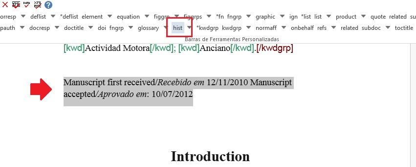

.. _doc-mkp:

Documentação de uso Markup
==========================

.. _journals-pmc:

Revistas elegíveis ao PMC
==========================

 Os Periódicos que são elegíveis ao PMC são aqueles que pertencem à area de Ciência da Vida, produzem artigos no idioma em inglês e que apresentam imagens e tabelas de acordo com os requisitos PMC.
  

 Especificações de imagens e de extração de equações e tabelas como imagens do pdf:

 A imagem deve possuir alta resolução de pixels (ou dpi), o tamanho de largura e altura deve ao menos atingir o tamanho da imagem em versão impressa. Obs.: O recomendável é que se receba imagem no tamanho ou  acima do tamanho de exibição pretendido.

 +----------------------------------------------------------------------------------------------------------------------------------+
 |Exemplo PMC: Imagem de 900 x 600 pixels de altura e resolução de 300 dpi.                                                         |
 |                                                                                                                                  |
 | dimensão em pixel/resolução = dimensão física                                                                                    |
 |                                                                                                                                  |
 | 900 pixels / 300 dpi = 3 polegadas de largura / 7,62 cm (física) 600 pixels / 300 dpi = 2 polegadas de altura / 5,08 cm (física) |
 |                                                                                                                                  |
 | Tamanho de exibição pretendido = 3 x 2 polegadas / 7,62 x 5,08 cm                                                                |
 |                                                                                                                                  |
 |                                                                                                                                  |
 | A resolução da imagem deve ser de, em média, 600 dpi ou mais. Algumas imagens podem não atingir o número de dpis recomendado,    |
 | geralmente conjuntos de microfotografias, os quais podem ser de 300dpi.                                                          |
 |                                                                                                                                  |
 +----------------------------------------------------------------------------------------------------------------------------------+

 consultar a seção do site do PubMed Cental  “File Submission Specifications: Images” em: <http://www.ncbi.nlm.nih.gov/pmc/pub/filespec-images/>.

 Revistas não elegíveis ao PMC *
 ===============================

 Para revistas não elegíveis ao PubMed Central, não há a necessidade de enviar imagens em alta resolução. 
 O SciELO aceita arquivos nos seguintes formatos:  jpg, .jpeg, .gif, .png e .eps.

 Verifique no link abaixo se o periódico faz parte do 

.. _introduction:

Introdução
==========

Este manual tem como objetivo auxiliar no processo de marcação de arquivos para geração de XML de acordo com SciELO PS.
Para padrões de nomeação de arquivos consultar  Regra de Nomeação de Arquivos em :ref:`regra-nomeação`

.. _requirements-markup:

 Requisitos para iniciar a Marcação
 ===================================
 
 Antes de iniciar o processo de marcação, é necessário seguir alguns passos para preparação do arquivo que será marcado.
 Veja abaixo os requisitos para a marcação do documento.
 
 * Os arquivos devem estar em formato Word (.doc) ou (.docx).
 * A estrutura de pastas deve seguir o padrão SciELO
 * Os arquivos devem ser formatados de acordo com a Formatação SciELO.
 

.. note:: A nomeação dos arquivos que serão trabalhados não deve conter espaços, acentos ou caracteres especiais. Caso seja
necessário separar uma informação de outra use underline. Apenas dessa forma as imagens marcadas no corpo do texto serão 
renomeadas e geradas corretamente. Exemplo: ACB_2345.doc

.. _structure-folders:

Estrutura de pastas
===================

Antes de iniciar a marcação, é necessário garantir que a estrutura de pastas
esteja como segue:

Note que dentro da pasta "markup_xml" foi inserido 2 pastas, no mesmo nível:

 * src: A pasta src (source) é utilizada para inserir os arquivos .pdf, vídeos e suplementos.
 * scielo_markup: Nessa pasta deve ser inserido os arquivos .doc ou .docx.

..  note:: Caso o responsável pela marcação não siga a recomendação de estrutura apresentada acima, não será possível iniciar a marcação do documento e gerar o arquivo .xml.

.. _format-scielo:

Formatação SciELO
------------------

Para otimizar o processo de marcação dos elementos básicos do arquivo, é necessário seguir o padrão de formatação SciELO disponível abaixo:

Instruções para formatação de dados básicos do artigo:

 * Primeira linha do documento, inserir número de DOI (somente se presente), caso não exista deixar linha em branco;
 * Na próxima linha, inserir a seção do sumário (Se ausente, deixar linha em branco);
 * Linha 3: Título do artigo;
 * Linhas seguintes: Títulos traduzidos do arquivo;
 * Para separar autores de título, pular 1 linha;
 * Cada autor deve estar em uma linha e usar "sup" para label;
 * Pular 1 linha para separar autores de afiliações;
 * Cada afiliação deve estar em uma linha;
 * Pular 1 linha para separar afiliação de resumos;
 * Resumos estruturados: negrito no nome da seção;
 * Palavras-chave: os separadores devem ser ou ponto-e-vírgula ou vírgula;
 * Seções: negrito, Times New Roman, 16, centralizadas;
 * Subseções: negrito, Times New Roman, 14, centralizadas;
 * Subseção de subseção: negrito Times New Roman, 13, centralizadas;
 * Texto: formatação livre;
 * Para tabelas, label e caption na linha antes da imagem, mas os demais, após a imagem;
 * Separador de label e caption: dois-pontos e espaço ou espaço + hífen + espaço ou ponto + espaço;
 * Para tabelas codificadas, o cabeçalho deve estar em negrito;
 * A citação de autor/data no corpo do texto deve ser: sobrenome do autor, ano;
 * Para citação no sistema numérico no corpo do texto: "sup" e entre parênteses;
 * Notas de rodapé no corpo do texto podem estar em "sup", mas não estarão entre parênteses;
 * Citações (quote), recuo de 4 cm da margem esquerda;

Exemplo:

   .. image:: img/doc-mkp-formatacao.jpg

.. note:: As imagens dos arquivos devem estar disponíveis no arquivo .doc e marcado com o elemento indicado.

.. _attribution-id:

Sugestão de Atribuição de “ID”
-----------------------------

Para composição do “ID” combine o prefixo do tipo do elemento e um número inteiro, como segue::

+----------------+--------------------+---------+--------------------+
|Elemento XML    | Descrição          | Prefixo | Exemplo            |
+================+====================+=========+====================+
| aff            | Afiliação          | aff     | aff1, aff2...      |
+----------------+--------------------+---------+--------------------+
| app            | Apêndice           | app     | app1, app2...      |
+----------------+--------------------+---------+--------------------+
| author-notes/  | Notas de rodape do | fn      | fn1, fn2 ...       |
|   fn           | artigo             |         |                    |
+----------------+--------------------+---------+--------------------+
| corresp        | Correspondência    | c       | c1, c2 ...         |
+----------------+--------------------+---------+--------------------+
| def-list       | lista de definição | d       | d1, d2 ...         |
+----------------+--------------------+---------+--------------------+
| disp-formula   | Equação            | e       | e1, e2 ...         |
+----------------+--------------------+---------+--------------------+
| fig            | Figuras            | f       | f1, f2 ...         |
+----------------+--------------------+---------+--------------------+
| media          | Media              | m       | m1, m2 ...         |
+----------------+--------------------+---------+--------------------+
| ref            | Referência         | B       | B1, B2 ...         |
|                | Bibliográfica      |         |                    |
+----------------+--------------------+---------+--------------------+
| sec            | Seções             | sec     | sec1, sec2 ...     |
+----------------+--------------------+---------+--------------------+
| supplementary- | Suplemento         | suppl   | suppl1, suppl2 ... |
|material        |                    |         |                    |
+----------------+--------------------+---------+--------------------+
|table-wrap-foot/| Notas de rodapé de | TFN     | TFN1, TFN2 ...     |
|   fn           | tabela             |         |                    |
+----------------+--------------------+---------+--------------------+
| table-wrap     | Tabela             | t       | t1, t2 ...         |
+----------------+--------------------+---------+--------------------+

.. _markup-elements:

Marcação dos elementos básicos do documento
===========================================

Após formatar os dados básicos do arquivo, o próximo passo é dar início a marcação XML. 
Primeiramente, abra o arquivo .doc no Word e selecione a tag [doc]:

.. image:: img/doc-mkp-formulario

Perceba que ao clicar em [doc] o programa irá abrir uma caixa de diálogo onde deverá ser inserido os metadados do arquivo:

Insira o nome da revista no campo jtitle* que o programa irá inserir as informações da revista automaticamente. 
Feito isso, o próximo passo é completar as informações nos demais campos. Veja abaixo os campos que devem ser preenchidos:

+-------------------+---------------------------------------------------------------------------------------+
| license           | se não for inserido automaticamente, preencher com a URL da licença creative commons  |
|                   | adotada pelo periódico                                                                |
+-------------------+---------------------------------------------------------------------------------------+
| volid             | Inserir volume, se existir                                                            |
+-------------------+---------------------------------------------------------------------------------------+
| supplvol          | Caso seja um suplemento de volume incluir sua parte ou número correspondente.         |
|                   | Exemplo: vol.12 supl.A, então preencha com A, neste campo                             |
+-------------------+---------------------------------------------------------------------------------------+
| issueno           | Entre com o número do fascículo. Caso seja um artigo publicado em ahead of            |
|                   | print, insira ahead neste campo                                                       |
+-------------------+---------------------------------------------------------------------------------------+
| supplno           | Caso seja um suplemento de fascículo incluir sua parte ou número                      |
|                   | correspondente. Exemplo: n.37, supl.A, então preencha com A neste campo               |
+-------------------+---------------------------------------------------------------------------------------+
| isidpart          | Usar em casos de press release, incluindo a sigla pr                                  |
+-------------------+---------------------------------------------------------------------------------------+
| dateiso           | Data de publicação formada por ano, mês e dia (YYYYMMDD). Preencher sempre            |
|                   | com o último mês da periodicidade. Por exemplo, se o periódico é bimestral            |
|                   | preencher 20140600. Use 00 para mês e dia nos casos em não haja sua                   |
|                   | identificação. Exemplo: 20140000.                                                     |
+-------------------+---------------------------------------------------------------------------------------+
| month/season      | Entre o mês ou mês inicial barra final, em inglês (três letras) e ponto,              |
|                   | exceto para May, June e July. Ex.: May/June, July/Aug.                                |
+-------------------+---------------------------------------------------------------------------------------+
| fpage             | Primeira página do documento                                                          |
+-------------------+---------------------------------------------------------------------------------------+
| @seq              | Para artigos que iniciam na mesma página de um artigo anterior, incluir a             |
|                   | sequência com letra                                                                   |
+-------------------+---------------------------------------------------------------------------------------+
| lpage             | Inserir a última página do documento                                                  |
+-------------------+---------------------------------------------------------------------------------------+
| elocatid          | Elocatid                                                                              |
+-------------------+---------------------------------------------------------------------------------------+
| order (in TOC)    | Incluir a ordem do artigo no sumário do fascículo. Deve ter, no mínimo, dois          |
|                   | dígitos. Por exemplo, se o artigo for o primeiro do sumário, preencha este            |
|                   | campo com 01 e assim por diante.                                                      |
+-------------------+---------------------------------------------------------------------------------------+
| pagcount*         | Inserir o total de paginação                                                          |
+-------------------+---------------------------------------------------------------------------------------+
| doctopic*         | Informar o tipo de documento a ser marcado. Por exemplo: artigo original, resenha,    | 
|                   | carta, comentário, etc                                                                |
+-------------------+---------------------------------------------------------------------------------------+
| language*         | Informe o idioma principal do texto a ser marcado                                     |
+-------------------+---------------------------------------------------------------------------------------+
| version*          | Identifica a versão da DTD usada no processo de marcação (A versão atual é 4.0)       |
+-------------------+---------------------------------------------------------------------------------------+
| artdate (rolling) | Obrigatório completar com a data YYYYMMDD quando for um artigo rolling pass. Rolling  |
|                   | pass é um modelo publicação onde o periódico publica seus artigos num volume único a  |
|                   | medida em que estes ficam prontos                                                     |
+-------------------+---------------------------------------------------------------------------------------+
| ahpdate           | Indicar a data de publicação de um artigo publicado em ahead of print                 |
+-------------------+---------------------------------------------------------------------------------------+

..note:: Os campos que apresentam um asterisco ao lado, são campos obrigatórios.

.. _markup-front:

Marcação automática do 'front'
==============================

Tendo preenchido todos os campos, ao clicar em [Ok] o programa irá abrir uma janela perguntando se o documento está de acordo com o modelo para efetuar a marcação automática:

.. image:: img/doc-mkp-

Ao clicar em [Sim] veja que o programa efetua a marcação automática dos elementos básicos do documento:

.. image:: img/doc-mkp-

.. note:: Caso o arquivo esteja com a formatação recomendada, o programa Markup irá fazer a marcação automática de DOI, seção (esses dois primeiros, se presente), título e títulos traduzidos, autores, label de autores e afiliações.

Após a marcação automática é necessário completar a marcação dos elementos básicos. 

.. _title:

Doctitle
--------

Confira o idioma inserido em [doctitle] para títulos traduzidos e se necessário, corrija.
Para corrigir, selecione a tag "incorreta" e clique no botão "lápis" para editar os atributos:

.. image:: img/doc-mkp-

 Faça o mesmo para os demais títulos traduzidos.

.. _authors:

Autores
-------

Alguns autores apresentam mais que 1 label ao lado do nome, porém o programa não faz a marcação automática de mais que 1 label. Para isso, selecione o label do autor e identifique com o elemento [xref]. Veja:

.. image:: img/doc-mkp-

Note que para identificar o label de autor relacionado à afiliação, o tipo de xref (ref-type) selecionado foi o "affiliação" e o rid "aff3" para relacionar o label 3 à afiliação correspondente.

Autores que apresentam a informação de função, como o cargo exercido, o programa Markup não faz a marcação automática desse dado. Para isso é necessário selecionar a informação que consta ao lado do nome do autor, ir para o nível inferior do elemento [author] e identificar esse dado com a tag [role]. Veja:

.. image:: img/doc-mkp-role-autor.jpg

.. _afiliation:

Afiliações
----------

O Programa Markup faz a identificação apenas de [normaff] de afiliações, ou seja, o detalhamento das afiliações não é feto automaticamente.
Ao fazer a marcação automática dos elementos básicos do arquivo, complete a marcação de afiliações identificando: instituição maior [orgname], divisão 1 [orgdiv1], divisão 2 [orgdiv2], cidade [city], estado [state] (esses 4 ultimos, se presentes) e o país [country].

Para fazer a identificação dos elementos acima é necessário ir para o nível inferior do elemento [normaff] e faça o detalhamento de cada afiliação. Veja:

.. image:: img/doc-mkp-detalhamento-aff

Após o detalhamento de afiliações o próximo passo é fazer a normalização das instituições e países. Para isso, selecione o elemento [normaff] e clique no "lapis" para editar os atributos. O programa irá apresentar uma janela para normalização dos elementos indicados nos campos em branco. Veja:

.. image:: img/doc-mkp-normalizacao-aff.jpg

No campo "icountry" selecione o país da instituição maior (orgname), em seguida clique em "find" para encontrar a instituição normalizada. Ao fazer esse procedimento, o programa Markup irá fazer uma busca no WAYTA e verificar se a instituição selecionada foi normalizada e consta na lista.

.. image:: img/doc-mkp-normalizadas.jpg

.. note:: Caso a instituição não exista na lista do Markup, selecione o elemento "No match found" e clique em [OK].

.. _abstract:

Resumos
=======

Os resumos devem ser identificados manualmente. Para marcação de resumos simples (não apresentam seções) e para os resumos estruturados (apresentam seções) utilizar o elemento [xmlabstr]. Na marcação selecione o título do resumo e o texto e em seguida marque com o botão [xmlabstr], dessa forma a interface web do SciELO assumirá a forma como o periódico adota para identificar o elemento.
Observe que ao utilizar o [xmlabstr] para resumos simples, o programa marca automaticamente o título e o parágrafo do resumo:

Resumo sem seção:
-----------------

selecionando: .. image:: img/doc-mkp-select-abstract-s.jpg

Note que ao clicar em [xmlabstr] o programa abrirá uma janela a qual deverá ser indicado o idioma do resumo marcado:

marcação: .. image:: img/doc-mkp-idioma-resumo.jpg
          .. image:: img/doc-mkp-mkp-abstract.jpg

Já resumos estruturados, além do programa identificar o título automaticamente é identificado também cada seção do resumo e seus respectivos parágrafos. Veja:

Resumo com seção:
-----------------

selecionando: .. image:: img/doc-mkp-select-abstract.jpg

Note que ao clicar em [xmlabstr] o programa abrirá uma janela a qual deverá ser indicado o idioma do resumo marcado:

marcação: .. image:: img/doc-mkp-idioma-abstract.jpg
          .. image:: img/doc-mkp-mkp-resumo.jpg

.. _keyword:

Keywords
========

O programa Markup apresenta duas tags para identificação de palavra-chave, a tag [*kwdgrp] e [kwdgrp].
A tag [*kwdgrp], com asterisco, é utilizada para identificação automática de cada palavra-chave e também do título. Para isso, selecione toda a informação inclusive o título e identifique os dados com o elemento [*kwdgrp].

Marcação automática:
--------------------

selecionando: .. image:: img/doc-mkp-select-kwd.jpg

Note que ao clicar em [*kwdgrp] o programa abrirá uma janela a qual deverá ser indicado o idioma das palavra-chave marcada:

marcação: .. image:: img/doc-mkp-mkp-kwd.jpg
          .. image:: img/doc-mkp-kwd-grp.jpg
          

Marcação manual:
----------------

A tag [kwdgrp], sem asterisco, deve ser utilizada caso a identificação automática não funcione, porém a especificação das palavras deve ser manual. Ou seja, selecione e marque item por item. Primeiramente selecione o título das palavras-chave e as palavras descritas e em seguida identifique com o elemento [kwdgrp]:

marcação: .. image:: img/doc-mkp-selection-kwd-s.jpg

Feito a marcação de todos os dados de palavras-chave, o próximo passo é fazer a identificação de item por item, iniciando pelo título. Para isso selecione o título das palavras-chave e identifique com o elemento [sectitle]:

.. image:: img/doc-mkp-sec-kwd.jpg

Em seguida selecione palavra por palavra e identifique com o elemento [kwd]:

.. _history:

History
=======

O elemento [hist] é utilizado para identificar o histórico do documento. Para isso selecione toda a informação de histórico e marque com o elemento [hist]:

Feito isso selecione a data de recebido e identifique com o elemento [received]. Confira a data ISO indicada no campo dateiso e corrija, se necessário. A estrutura da data ISO esperada nesse campo é:
ANO MÊS DIA. Veja:

.. image:: img/doc-mkp-received.jpg

Caso haja a data de revisado, selecione o dado e identifique com o elemento [revised]. Faça o mesmo para a data de aceito; selecione a data e identitique com o elemento [received]. Confira a data ISO indicada no campo dateisso e corrija se necessário. Veja:

.. image:: img/doc-mkp-accepted.jpg

.. _correspondence:

Correspondence
==============

Com o elemento [corresp] é possível fazer a identificação dos dados de correspondência do autor. Note que essa tag possui um subnível para identificação do e-mail do autor. 
Para identificar esse dado, selecione toda a informação de correspondência e marque com o elemento [corresp]. Note que será apresentado uma janela para identificação do id de correspondência, nesse caso inserir "c" + o número de ordem da correspondencia. Veja:

.. image:: img/doc-mkp-corresp-select.jpg

Feito isso, selecione o e-mail do autor correspondente e identifique com o elemento [email]:

.. _references:

Referencias
===========

As referências bibliográficas são identificadas elemento a elemento e seu formato original é mantido para apresentação no SciELO.

Para marcar referências bibliográficas selecione o grupo de referências, inclusive o título "Referências Bibliográficas" ou o título que estiver disponível e identifique com o elemento [refs]. Dessa forma o programa irá identificar todas as referências selecionadas com a tag [ref]. Veja:

.. image:: img/doc-mkp-select-refs-mkp.jpg

.. _ref-type:

Tipos de Referências
====================

A partir da marcação feita, alguns tipos de referência serão alterados automaticamente sem intervenção manual (ex.: tese, conferência e artigo de periódico); já para os demais casos, será necessário a alteração manual.
Para alterar o tipo de referência clique no elemento [ref] e em seguida clique no lápis "Editar Atributos" e em "reftype" selecione o tipo correto. Veja:

.. note:: Uma referência deve ter sua tipologia sempre baseada no seu conteúdo e nunca no seu suporte. Ou seja uma lei representa um documento legal, portanto o tipo de referência é “legal-doc”, não importa se foi publicado em um journal ou site. Uma referência de artigo de um periódico científico, mesmo que publicado em um site possui o tipo “journal”.
É importante entender estes aspectos nas referências para poder interpretar sua tipologia e seus elementos. Nem toda referência que possui um link é uma “webpage”, nem toda a referência que possui um volume é um “journal”, livros também podem ter volumes.

Veja abaixo os tipos de referência suportados por SciELO e a marcação de cada ref.

legal-doc
---------
Utilizada para referenciar documentos jurídicos, incluem informações sobre, legislação, jurisprudência e doutrina. Ex.:

Brasil. Portaria no 1169/GM em 15 de junho de 2004. Institui a Política Nacional de Atenção Cardiovascular de Alta Complexidade, e dá outras providências. Diário Oficial 2004; seção 1, n.115, p.57.

.. image:: img/doc-mkp-ref-legal-doc1.jpg

Report
------
Utilizada para referenciar relatórios técnicos, normalmente de autoria institucional. Ex.:

AMES, A.; MACHADO, F.; RENNÓ, L. R. SAMUELS, D.; SMITH, A.E.; ZUCCO, C. The Brazilian Electoral Panel Studies (BEPS): Brazilian Public Opinion in the 2010 Presidential Elections. Technical Note No. IDB-TN-508, Inter-American Development Bank, Department of Research and Chief Economist, 2013.

.. image:: img/doc-mkp-ref-report.jpg

Book
-----

Utilizada para referenciar livros ou parte deles (capítulos, tomos, séries e etc), manuais, guias, catálogos, enciclopédias, dicionários entre outros.
Ex.: 

LORD, A. B. The singer of tales. 4th. Cambridge: Harvard University Press, 1981.

Book no prelo
-------------
Livros finalizados, porém em fase de edição geralmente ao final da referência é apresentado a informação "no prelo", "forthcomming" ou "inpress". A marcação para referências do tipo book com essa particularidade deve ser feita conforme segue na imagem abaixo:

CIRENO, F.; LUBAMBO, C. Estratégia eleitoral e eleições para Câmara dos Deputados no Brasil em 2006, no prelo.

Book Chapter
------------
Divisão de um documento (título do artigo e seus respectivos autores - Podendo ou não constar informação de autores- , seguido do título do livro e seus respectivos autores) numerado ou não

Lastres, H.M.M.; Ferraz, J.C. Economia da informação, do conhecimento e do aprendizado. In: Lastres, H.M.M.; Albagli, S. (Org.). Informação e globalização na era do conhecimento. Rio de Janeiro: Campus, 1999. p.27-57.

Thesis
------
Utilizada para referenciar monografias, dissertações ou teses para obtenção de um grau acadêmico, tais como livre-docência, doutorado, mestrado, bacharelado, licenciatura, etc. Ex.:

PINHEIRO, Fernanda Domingos. Em defesa da liberdade: libertos e livres de cor nos tribu¬nais do Antigo Regime português (Mariana e Lisboa, 1720-1819). Tese de doutorado, Departamento de História, Instituto de Filosofia e Ciências Humanas, Univer¬sidade Estadual de Campinas, 2013

.. image:: img/doc-mkp-ref-thesis.jpg

Confproc
--------
Utilizada para referenciar documentos relacionados à eventos: atas, anais, resultados, proceedings, convenções, conferências entre outros. Ex.:

FABRE, C. Interpretation of nominal compounds: combining domain-independent and domain-specific information. In: INTERNATIONAL CONFERENCE ON COMPUTATIONAL LINGUISTICS (COLING), 16, 1996, Stroudsburg. Proceedings... Stroudsburg: Association of Computational Linguistics, 1996. v.1, p.364-369.

.. image:: img/doc-mkp-ref-confproc.jpg

Webpage
-------
Utilizada para referenciar, web sites ou informações contidas em blogs, twiter, facebook, listas de discussões dentre outros. Ex.: 

UOL JOGOS. Fórum de jogos online: Por que os portugas falam que o sotaque português do Brasil é açucarado???, 2011. Disponível em <http://forum.jogos.uol.com.br/_t_1293567>. Acessado em 06 de fevereiro de 2014.

.. image:: img/doc-mkp-ref-web-uol.jpg

BANCO CENTRAL DO BRASIL. Disponível em: www.bcb.gov.br.

.. image:: img/doc-mkp-ref-web-bb.jpg

journal
-------
Utilizada para referenciar publicações seriadas científicas, como revistas, boletins e jornais, editadas em unidades sucessivas, com designações numéricas e/ou cronológicas e destinada a ser continuada indefinidamente. Ex.:

Cardinalli, I. (2011). A saúde e a doença mental segundo a fenomenologia existencial. Revista da Associação Brasileira de Daseinsanalyse, São Paulo, 16, 98-114.

.. image:: img/doc-mkp-ref-journal.jpg

Other
-----
Utilizada para referenciar tipos não previstos pelo SciELO. Ex.:

INAC. Grupo Nacional de Canto e Dança da República Popular de Moçambique. Maputo, [s.d.].

.. image:: img/doc-mkp-ref-other.jpg

Database
--------
Utilizada para referenciar bases e bancos de dados. Ex.:

IPEADATA. Disponível em: http://www.ipeadata.gov.br.  Acesso em: 12 fev. 2010.

.. image:: img/doc-mkp-ref-database.jpg

Software
--------
Utilizada para referenciar um software, um programa de computador. Ex.:

Nelson KN. Comprehensive body composition software [computer program on disk]. Release 1.0 for DOS. Champaign (IL): Human Kinetics, c1997. 1 computer disk: color, 3 1/2 in.

Newspaper**
---------
Utilizada para referenciar publicações seriadas sem cunho científico, como revistas e jornais. Ex.:

Patent**
------

Utilizada para referenciar patentes; a patente representa um título de propriedade que confere ao seu titular o direito de impedir terceiros explorarem sua criação.. Ex.:

.. _footnote:

Notas de Rodapé
===============

As notas de rodapé podem ser identificadas antes do corpo do texto ou depois. Não há uma posição específica dentro do arquivo .doc. Entretando é necessário avaliar a nota indicada, pois dependendo do tipo de nota inserido em fn-type, o programa gera o arquivo .xml com informações de notas de autores nos metadados do artigo ou em :ref:`elemento-back`. Para mais informações sobre essa divisão consultar na documentação SPS os itens :ref:`elemento-notas-de-autor` e :ref:`elemento-notas-gerais` em :ref:`elemento-fn`.

Para identificar uma nota selecione o dado indicado e marque com o elemento [fngrp].

Caso a nota apresente um título ou um símbolo, selecione a informação e identifique com o elemento [label]:

.. image:: img/doc-mkp-fn-label-con.jpg

Suporte sem Informação de Financiamento
---------------------------------------

Para notas de rodapé que apresentam informação de suporte de entidade, instituição ou pessoa física sem informação de financiamento e número de contrato, selecionar o tipo "Pesquisa na qual o artigo é baseado foi apoiado por alguma entidade":

.. image:: img/doc-mkp-fn-label-con.jpg

Suporte com Informação de Financiamento
---------------------------------------

Notas de rodapé que apresentam informação de financiamento com número de contrato devem ter como "fntype" a informação "Declaração ou negação de recebimento de financiamento em apoio à pesquisa na qual o artigo é baseado". Esse tipo de nota de rodapé que possui um número de contrato, será necessária a marcação de dados de financiamento.
Para marcar o financiamento selecione os dados de instituição e número e identifique com o elemento [funding]:

.. image:: img/doc-mkp-select-fn-fdiscl.jpg

Feito isso, o próximo passo é selecionar o primeiro grupo de instituição financiadora + número de contrato e identificar com o elemento [award]. Veja:

.. image:: img/doc-mkp-award-select.jpg

Após a identificação de [award] selecione a instituição financiadora e marque com o elemento [fundsrc]:

.. image:: img/doc-mkp-fund-source-fn.jpg

Depois selecione cada número de contrato e identifique com o elemento [contract]:

.. image:: img/doc-mkp-contract-fn.jpg

Caso a nota de rodapé apresente mais que uma instituição financiadora e número de contrato, faça a marcação conforme segue o exemplo abaixo:

.. image:: img/doc-mkp-mkp-fn-fund-2.jpg

.. _app:

Apêndices **
=========

.. _ack:

Agradecimentos **
==============

.. _xmlbody:

Identificação [xmlbody] **
=======================

Tendo formatado o corpo do texto de acordo com o ítem :ref:`iten-Formatando dados básicos do artigo` e após a identificação das referências bibliográficas, é possível fazer a marcação do [xmlbody].

Primeiramente, selecione todo o corpo do texto e clique no botão xmlbody, confira as informações de seções, subseções, citações etc que é apresentado na caixa de diálogo que abrirá e se necessário, corrijaem seguida e clique em “Aplicar”.

.. image:: 

Caso haja alguma informação incorreta, selecione o item a ser corrigido na janela, clique no menu dropdown ao lado do botão “Modificar”, selecione a opção correta e clique em “Modificar”. Em seguida é só clicar no botão “Aplicar”.

.. _section:

Seções e subseções**
==================

Após a marcação automática do xmlbody, verificar se as seções e os tipos de seções foram selecionados corretamente.
Caso contrário, edite a tag e selecione o sec-type correto. Em casos de seções que apresentam dois tipos ou mais (Exemplo: “Resultados e Discussão”, “Resultados e Conclusões”), a identificação do tipo de seção não é automática, é necessário editar a tag e selecionar o tipo combinado adequado (no menu dropdown as seções combinadas são precedidas por asterisco).

