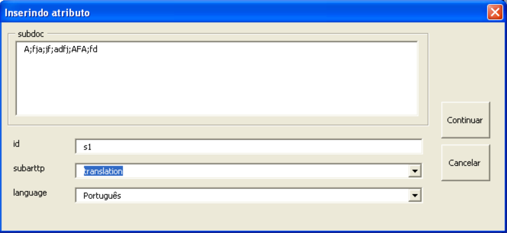
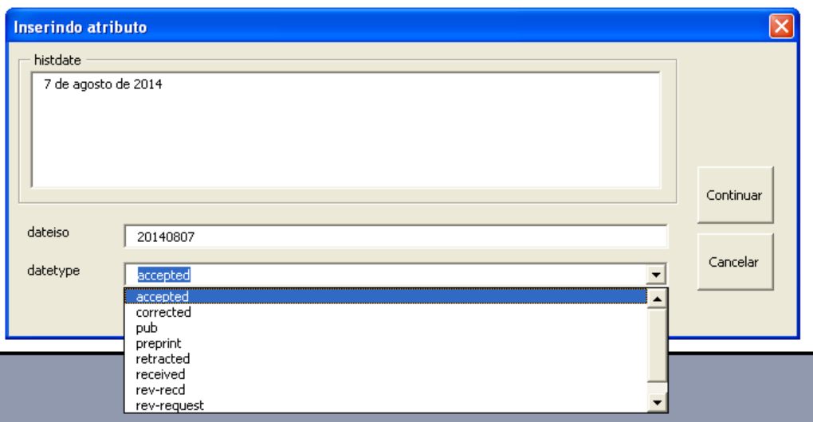

# Open Peer Review: Markup e Geração do XML para Pareceres

Este guia apresenta como identificar no programa de marcação os dados relacionados a **pareceres**.


## Identificação que o documento é um parecer

Identificação do atributo "article-type" do elemento "article"

Para que seja gerado

```xml
<article article-type="referee-report">
```

no arquivo marcado deve conter, no elemento `doc`, o atributo `doctopic` com valor `referee-report`

```xml
[doc doctopic="referee-report" ... ]
```

O valor `referee-report` é apresentado com uma das opções do campo `doctopic` do formulário do elemento principal `doc`.

   


## Identificação dos pareceres anexados ao documento revisado

Quando cada parecer está em anexo ao documento avaliado.

Identificação do atributo "article-type" do elemento "sub-article"

Para que seja gerado

```xml
<sub-article article-type="referee-report">
```

no arquivo marcado deve conter, no elemento `subdoc`, o atributo `subarttp` com valor `referee-report`

```xml
[subdoc subarttp="referee-report" ... ]
```

O valor `referee-report` é apresentado com uma das opções do campo `subarttp` do formulário do elemento `subdoc`.

   


## Identificação do papel do parecerista (revisor ou editor)

Para que seja gerado

```xml
<role specific-use="reviewer">Reviewer</role>
```

ou

```xml
<role specific-use="editor">Editor</role>
```

em 

```xml
<contrib contrib-type="author">
    <name>
        <surname>Doe</surname>
        <given-names>Jane X</given-names>
    </name>
    <role specific-use="reviewer">Reviewer</role>
</contrib>
```


no arquivo marcado deve conter, no elemento `oprrole`, o atributo `specuse` com valor `reviewer` ou `editor`


```xml
[oprrole specuse="reviewer"]Reviewer[/oprrole]
```

ou

```xml
[oprrole specuse="editor"]Editor[/oprrole]
```

Os valores `reviewer` e `editor` são apresentados com opções do campo `specuse` do formulário do elemento `oprrole`.


   

   

   

## Identificação do anonimato do parecerista (revisor ou editor)

Para que seja gerado

```xml
<anonymous/>
```

em 

```xml
<contrib contrib-type="author">
    <anonymous/>
    <role specific-use="reviewer">Reviewer</role>
</contrib>
```

no arquivo marcado deve conter, no elemento `anonymous` e é obrigatório o uso de `oprrole`.

```sgml
[anonymous][/anonymous]
```

```xml
[oprrole specuse="reviewer"]Reviewer[/oprrole]
```

ou

```xml
[oprrole specuse="editor"]Editor[/oprrole]
```

Os valores `reviewer` e `editor` são apresentados com opções do campo `specuse` do formulário do elemento `oprrole`.

   

   

   

## Identificação do artigo revisado

Indicar **artigo revisado** no documento do **parecer** da seguinte forma:

```xml
<related-object
	object-type="peer-reviewed-material"
	id="r01"
	xlink:href="10.1590/abd1806-4841.20142998"
	ext-link-type="doi"/>        
```

no arquivo marcado deve conter, no elemento `related` com o atributo `reltp` cujo valor é `peer-reviewed-material`

```sgml
[related reltp="peer-reviewed-material" pid-doi="10.1590/abd1806-4841.20142998"][/related]
```

Para o atributo `pid-doi`, preencher com o valor do PID ou DOI do artigo revisado.


   


   


## Identificação do parecer externo

Indicar o **parecer** que está publicado em outro site da seguinte forma:

```xml
<related-object
	object-type="referee-report"
	ext-link-type="uri"
	xlink:href="https://publons.com/publon/000000/#review-2020xxx"
	>Publons</related-object>        
```

no arquivo marcado deve conter, no elemento `related` com o atributo `reltp` cujo valor é `referee-report`

```sgml
[related reltp="referee-report" pid-doi="https://publons.com/publon/000000/#review-2020xxx"]Publons[/related]
```

Para o atributo `pid-doi`, preencher com o valor do PID ou DOI do artigo revisado.


   


   


## Identificação da data de recebimento do parecer

A representação da data de recebimento do parecer é feita por:

```xml
<history>
    <date date-type="referee-report-received">
      <day>10</day>
      <month>01</month>
      <year>2020</year>
    </date>
</history>
```

no arquivo marcado deve conter, no elemento `hist`, o elemento `histdate`, com o atributo `datetype` cujo valor é `referee-report-received`


   


   


## Identificação de metadados sem _tags_ definidas

**`<custom-meta>`**

Elemento para identificar metadados para os quais não há _tags_ definidas.

Permite uma variedade **sem limite fixo** de pares **nome e valor**, com poucas restrições no comprimento ou no conteúdo do valor.

```xml
<custom-meta-group>
   <custom-meta>
     <meta-name>peer-review-recommendation</meta-name>
     <meta-value>accept</meta-value>
   </custom-meta>
   <custom-meta>
     <meta-name>nome2</meta-name>
     <meta-value>valor2</meta-value>
   </custom-meta>
   <custom-meta>
     <meta-name>nome3</meta-name>
     <meta-value>valor 3</meta-value>
   </custom-meta>
</custom-meta-group>
```

no arquivo marcado use:

- `customgrp` para gerar `custom-meta-group`
- `custom` para gerar `custom-meta`
- `name` para gerar `meta-name`
- `value` para gerar `meta-value`

